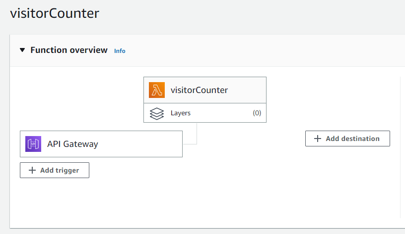
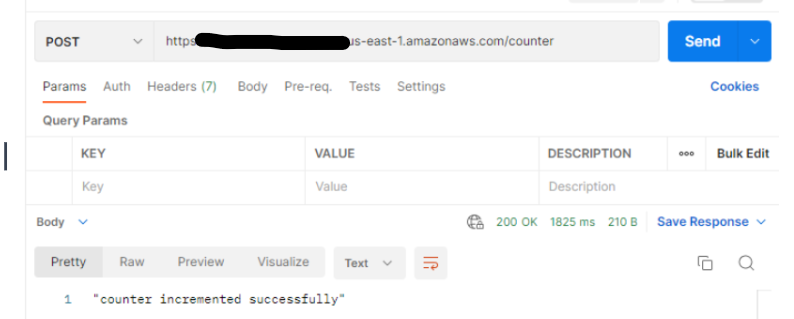

# cloud-resume-challenge
 - A 16-step outline created by Forrest Brazeal to deploy a static website in your cloud provider of choice, with a focus on integrating and maintaining backend services with key DevOps automation skills.  Having recently become a Certified AWS Cloud Practionner, I was excited to expand my hands-on experience in AWS.

-The goal of the challenge is to promote self-learning, as it provides only high-level guidance **not step-by-step instructions**- on how to implement core topics such as DNS, APIs, Testing, Infrastructure-as-Code, and CI/CD !


### **Thefollowing are the steps to acheive the challenge **

## 1-Building and Deploying the FrontEnd

I created a basic version of my resume using **HTML/CSS**, which I then stored in an **S3** bucket. In order to make sure that my website was accessible via an HTTPS connection, I had to create a **CloudFront** distribution that was linked to my bucket, and attached a TLS certificate using  **Amazon Certificate Manager**. Finally, I needed to use **Route 53** to point my custom domain name to the distribution endpoint, Once this was done, my site was publicly available on the web, accessible via a custom domain and the secure **HTTPS** protocol.


## 2- Building the Backend :
 - Services :  ** API Gateway, Lambda, DynamoDB, JavaScript **
  ### ***a- Create a lambda function ta communicate whith the database to increment the vistor counter***
  ```py
  import json
import boto3
def lambda_handler(event, context):
    dynamodb = boto3.resource('dynamodb')
    table=dynamodb.Table('houda')
    
    try:
        response=table.get_item(
        Key={
            'id':0
        }
        
        )
        my_count=response['Item']['counter']
        # TODO: write code...
    except:
        my_count=1
    
    new_counter=my_count+1
    
    #updating the table
    
    table.update_item(
        Key={
         'id': 0,
            
        },
    UpdateExpression='SET #counter = :val1',
    ExpressionAttributeValues={
         ':val1': response['Item']['counter']+1
        
    },
    ExpressionAttributeNames={
    "#counter": "counter"
        
    }

    )
    return {
        'statusCode': 200,
        'headers': {
            'Content-Type': 'application/json',
            'Access-Control-Allow-Origin': '*'
        },
        'body': json.dumps({'total_visitor': str(new_counter)})
    }


  ```

  ### ***b- Trigger your Lambda function from the outside world ***
  
  - Put an **API Gateway** route in front of your **Lambda** function

  

  

**Testing my api endpoint using postman**

  


